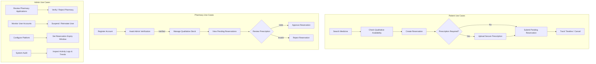

# MediLink Master Architecture & Project Plan

## 1. Product Overview
**MediLink** is a Smart Medicine Discovery & Reservation Platform designed to address a critical healthcare challenge: patients frequently waste time visiting multiple local pharmacies to find required medicines. MediLink enables patients to search for medicines, discover verified nearby pharmacies offering them, check qualitative availability (**AVAILABLE**, **LIMITED**, **UNAVAILABLE**), reserve items with required prescription uploads, and track pickup status. Pharmacies manage medicine availability and fulfill reservation requests, while Administrators manage pharmacy verification, user permissions, platform audits, and system parameters.

> **Non-Negotiable Scope**: MediLink is **NOT** an online store, e-commerce, home delivery, doctor appointment, telemedicine, hospital, insurance, or AI diagnosis platform. It focuses strictly on **Medicine Discovery + Qualitative Availability + Reservation + Prescription Handling + Pharmacy Operations + Platform Administration**.

---

## 2. Functional Requirements (SRS Traceability Matrix)

| Requirement ID | Module | Description | Target Role |
| :--- | :--- | :--- | :--- |
| **FR-PAT-01** | Patient | Real-time database search for medicines by name, generic name, category | Patient |
| **FR-PAT-02** | Patient | View verified pharmacies offering specific medicine with qualitative availability | Patient |
| **FR-PAT-03** | Patient | Multi-step reservation wizard (Select Pharmacy -> Confirm -> Upload Prescription -> Review) | Patient |
| **FR-PAT-04** | Patient | Private prescription upload to secure Supabase storage (PDF, JPEG, PNG, WEBP, <= 10MB) | Patient |
| **FR-PAT-05** | Patient | Real-time reservation status visual timeline tracking & cancellation | Patient |
| **FR-PHR-01** | Pharmacy | Pharmacy registration & pending verification onboarding state | Pharmacy |
| **FR-PHR-02** | Pharmacy | Availability management (AVAILABLE, LIMITED, UNAVAILABLE) without exposing exact stock | Pharmacy |
| **FR-PHR-03** | Pharmacy | Reservation request processing (Approve / Reject with justification) | Pharmacy |
| **FR-PHR-04** | Pharmacy | Secure prescription review in isolated viewer with signed access tokens | Pharmacy |
| **FR-PHR-05** | Pharmacy | Basic operational dashboard, metrics, and notification center | Pharmacy |
| **FR-ADM-01** | Admin | Pharmacy verification workflow (Verify / Reject / Revoke) with audit logs | Admin |
| **FR-ADM-02** | Admin | User management (Suspend / Reinstate users) with self-suspension guard | Admin |
| **FR-ADM-03** | Admin | System reservation auditing (metadata only, no raw prescription content) | Admin |
| **FR-ADM-04** | Admin | Configurable automatic reservation expiry duration management | Admin |
| **FR-ADM-05** | Admin | Operational statistics, trend charts, and real-time activity audit logs | Admin |
| **FR-SYS-01** | System | Persistent database notifications with read state tracking across all roles | All |
| **FR-SYS-02** | System | Automated database-driven reservation expiry mechanism | System |

---

## 3. User Roles & Access Control Policy (RBAC)

MediLink enforces strict Role-Based Access Control (RBAC) across three distinct primary roles:

1. **PATIENT**:
   - Access: `/patient/*`
   - Allowed: Search medicines, view pharmacy availability, create/cancel reservations, upload own prescriptions, view own notifications.
   - Denied: Access to `/pharmacy/*` and `/admin/*`.

2. **PHARMACY**:
   - Access: `/pharmacy/*`
   - Allowed: Manage medicine qualitative availability, view and process assigned reservations, review patient prescriptions for assigned reservations.
   - Denied: Unverified pharmacies cannot alter public inventory. Access denied to `/patient/*` and `/admin/*`.

3. **ADMIN**:
   - Access: `/admin/*`
   - Allowed: Verify/reject/revoke pharmacies, suspend/reinstate users, audit reservation metadata, view system metrics, configure expiry timers.
   - Denied: Cannot suspend own admin account, public registration prohibited. Access denied to patient/pharmacy operational routes unless explicitly audited.

---

## 4. Core Use Cases



---

## 5. System Architecture

MediLink follows a decoupled, clean monorepo architecture separating the Single Page Application (SPA) client, RESTful Express backend, and Supabase PostgreSQL BaaS platform:

```
+-----------------------------------------------------------------------+
|                             CLIENT SPA                                |
|           React + Vite + TypeScript + Tailwind CSS + Zod              |
+-----------------------------------------------------------------------+
                                    |
                            HTTP / REST (JSON)
                                    v
+-----------------------------------------------------------------------+
|                           EXPRESS BACKEND                             |
|          Node.js + TypeScript + Helmet + CORS + Morgan + Zod           |
|        Routes -> Controllers -> Services -> Repositories Layer         |
+-----------------------------------------------------------------------+
|                           EXPRESS BACKEND                             |
|          Node.js + TypeScript + Helmet + CORS + Morgan + Zod           |
|        Routes -> Controllers -> Services -> Repositories Layer         |
+-----------------------------------------------------------------------+
                                    |
                         Supabase Python SDK
                                    v
+-----------------------------------------------------------------------+
|                         SUPABASE PLATFORM                             |
|    PostgreSQL Database (RLS Enforced) | Auth Service | Private Storage|
+-----------------------------------------------------------------------+
```

---

## 6. Frontend Architecture
- **Framework**: React 18+ with Vite and TypeScript.
- **Styling**: Tailwind CSS with custom design system tokens (Primary Navy `#001428`, Dark Blue `#0F2942`, Clinical Teal `#006A61`, Surface `#F8F9FF`, Text `#0B1C30`, Muted `#43474D`).
- **Typography**: Plus Jakarta Sans (Headings/Hero) + Inter (Body/Forms/Tables).
- **State Management & Data Fetching**: TanStack Query (React Query) for server state caching, invalidation, and optimistic updates.
- **Form Validation**: React Hook Form coupled with Zod schemas.
- **Routing & Guards**: React Router v6 with declarative `ProtectedRoute` components enforcing role verification (`PATIENT`, `PHARMACY`, `ADMIN`) and account status checks (`ACTIVE`, `SUSPENDED`, `VERIFIED`).
- **Icons & Visuals**: Lucide React icons, Recharts for administrative and pharmacy operational metrics.

---

## 7. Backend Architecture
- **Runtime**: Node.js with Express and TypeScript.
- **Pattern**: Strict Layered Architecture:
  - `Routes`: Endpoint definition, rate limiting, authentication & authorization middleware.
  - `Controllers`: Request parsing, HTTP status code management, response formatting.
  - `Services`: Core business logic, reservation state machine transitions, prescription validation.
  - `Repositories`: Database abstraction interacting with Supabase PostgreSQL via `@supabase/supabase-js`.
- **Validation**: Zod middleware validating `req.body`, `req.params`, and `req.query`.
- **Security Middleware**: Helmet for HTTP headers, CORS restricted to `CLIENT_ORIGIN`, express-rate-limit on auth endpoints.

---

## 8. Database Architecture (Supabase PostgreSQL)

### Primary Entities & Schema Design
- `users`: `id` (UUID, PK), `email`, `role` (Enum: PATIENT, PHARMACY, ADMIN), `status` (Enum: ACTIVE, SUSPENDED), `full_name`, `phone`, `created_at`, `updated_at`.
- `pharmacies`: `id` (UUID, PK), `user_id` (FK -> users.id), `name`, `license_number`, `address`, `city`, `phone`, `verification_status` (Enum: PENDING, VERIFIED, REJECTED, REVOKED), `rejection_reason`, `created_at`, `updated_at`.
- `medicines`: `id` (UUID, PK), `name`, `generic_name`, `category`, `description`, `dosage_form`, `requires_prescription` (BOOLEAN), `created_at`.
- `pharmacy_medicines`: `id` (UUID, PK), `pharmacy_id` (FK), `medicine_id` (FK), `availability` (Enum: AVAILABLE, LIMITED, UNAVAILABLE), `internal_stock_qty` (INTEGER - internal only, never exposed to patient API), `updated_at`.
- `reservations`: `id` (UUID, PK), `reservation_number` (UNIQUE TEXT), `patient_id` (FK -> users.id), `pharmacy_id` (FK -> pharmacies.id), `medicine_id` (FK -> medicines.id), `status` (Enum: PENDING, APPROVED, REJECTED, EXPIRED, CANCELLED), `status_reason`, `expires_at` (TIMESTAMPTZ), `created_at`, `updated_at`.
- `prescriptions`: `id` (UUID, PK), `reservation_id` (FK -> reservations.id), `patient_id` (FK), `storage_path` (TEXT), `file_name`, `mime_type`, `file_size`, `created_at`.
- `notifications`: `id` (UUID, PK), `user_id` (FK), `title`, `message`, `type`, `read` (BOOLEAN), `created_at`.
- `activity_logs`: `id` (UUID, PK), `user_id` (FK), `action`, `entity_type`, `entity_id`, `details` (JSONB), `created_at`.

---

## 9. Security Architecture
- **Authentication**: Supabase Auth (JWT handling, session refresh).
- **Authorization & RBAC**: Dual-layer verification — frontend route guards + backend route middleware checking JWT claims and backend `users` record.
- **IDOR Protection**: Repository layer validates resource ownership before executing queries (e.g. `patient_id === req.user.id` or `pharmacy_id === req.user.pharmacy_id`).
- **Prescription Privacy**: Storage bucket set to Private in Supabase. Access granted exclusively through short-lived signed URLs (15-min expiry) for authorized patient or fulfilling pharmacy. Admins see metadata only.
- **Input Sanitization**: Zod validation blocks malicious payloads before controller processing.

---

## 10. API Strategy & Response Format

All REST responses adhere to a uniform JSON envelope:

### Success Response Format:
```json
{
  "success": true,
  "data": { ... },
  "meta": {
    "page": 1,
    "limit": 20,
    "total": 100
  }
}
```

### Error Response Format:
```json
{
  "success": false,
  "message": "Human-readable error explanation",
  "code": "ERROR_CODE_STRING",
  "errors": []
}
```

---

## 11. Testing Strategy
- **Unit Testing**: Vitest for utility functions, validators, state machine transitions, and Zod schemas.
- **Integration Testing**: Supertest + Vitest testing Express endpoints (`/api/health`, `/api/auth`, `/api/medicines`, `/api/reservations`).
- **End-to-End (E2E) Testing**: Playwright suite running complete cross-role flows (Patient reservation -> Admin pharmacy verification -> Pharmacy approval -> Notification delivery).

---

## 12. Deployment Architecture
- **Client**: Deployed independently on Vercel (`https://medilink-client.vercel.app`) with `VITE_API_BASE_URL` pointing to backend.
- **Server**: Deployed on Render/Railway (`https://medilink-api.onrender.com`) as a persistent Express Node.js process.
- **Database & Storage**: Managed Supabase PostgreSQL with RLS enabled, Auth enabled, and Private Storage Bucket configured.

---

## 13. Phase Breakdown

- **PHASE 0**: Architecture & Monorepo Skeleton (Current Phase)
- **PHASE 1**: Design System & Public Landing Page
- **PHASE 2**: Database Schema, Supabase Auth & RBAC Middleware
- **PHASE 3**: Patient Module (Search, Detail, Reservation Wizard, Timeline)
- **PHASE 4**: Pharmacy Module (Onboarding, Availability Management, Review Dashboard)
- **PHASE 5**: Admin Module (Verification, User Controls, Auditing & Analytics)
- **PHASE 6**: Notifications, Background Expiry Engine & Workflows
- **PHASE 7**: Security Hardening, IDOR Audit & RLS Verification
- **PHASE 8**: Comprehensive Automated Testing (Vitest + Supertest)
- **PHASE 9**: Responsive UI/UX Polish & Accessibility (WCAG 2.1 AA)
- **PHASE 10**: Deployment Readiness & CI Setup
- **PHASE 11**: Production Deployment & Verification

---

## 14. Risk Analysis & Mitigation

| Risk | Mitigation Strategy |
| :--- | :--- |
| Exposing exact inventory stock to patients | API mapping layer converts internal numbers to strict qualitative status strings (`AVAILABLE`, `LIMITED`, `UNAVAILABLE`). |
| Unauthorized access to prescription files | Enforce Supabase Private Bucket storage; backend issues temporary 15-minute signed URLs after strict ownership checks. |
| Admin self-suspension or unauthenticated admin creation | Backend middleware explicitly prevents admin role target in suspension service; public registration rejects `role = ADMIN`. |
| Memory leaks or lost background expiry timers on server restart | Expiry engine runs database-driven interval queries (`expires_at < NOW() AND status = 'PENDING'`) rather than in-memory Node timeouts. |

---

## 15. Definition of Done (DoD)
A phase or feature is marked complete ONLY when:
1. TypeScript compilation passes without errors (`npm run typecheck`).
2. ESLint check succeeds without warnings (`npm run lint`).
3. Automated unit and integration tests execute successfully (`npm test`).
4. End-to-end user workflows execute seamlessly across Patient, Pharmacy, and Admin roles.
5. All security checks (RBAC, IDOR, input validation) pass verification.
6. Responsive layouts work across 375px, 768px, 1024px, and 1920px viewports.
